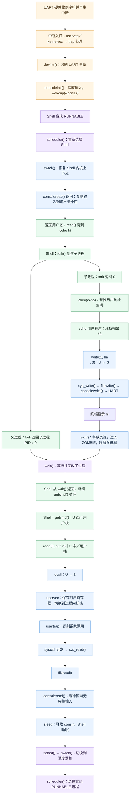
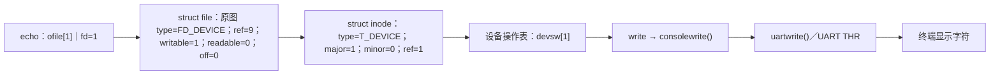
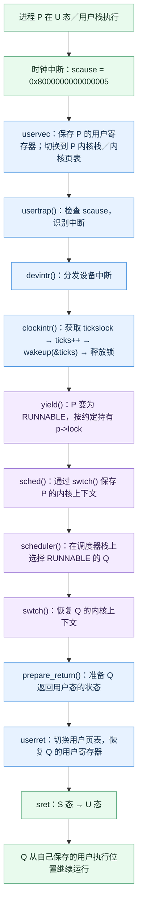

# Lab0 三张图（Markdown / Mermaid 版）

> 根据原有三张图片整理。流程图采用 Mermaid，表格采用 Markdown；保留图中的主要节点、状态、栈与特权级信息。它是可编辑的结构化版本，并非与原图片像素级相同的排版。文末列出原图中需注意的示意性表述。

## 图 1：`echo hi` 全系统控制流（从用户输入到子进程退出）

### 1.1 主流程、输入中断与调度

**图中三种运行位置：** 用户代码在 **U 态／用户栈**；系统调用与中断处理在 **S 态／进程内核栈**；`scheduler()` 在 **S 态／调度器栈**。`trapframe` 用来保存用户寄存器。锁仅在需要保护共享状态的临界区持有，不能把整条路径都理解为持续持锁。

**一句话理解：** Shell 睡眠等待输入 → UART 中断唤醒 Shell → Shell `fork` → 子进程 `exec` 和 `write` → 子进程 `exit` → 父进程 `wait` 回收。

---

## 图 2：核心数据结构三联快照

**截面：** `exec` 已成功，`echo` 第一条用户指令尚未执行。以下状态、具体引用计数及地址区间依照原图作为示意快照，不代表每次 xv6 运行都固定如此。

### 2.1 进程表快照

| 进程 | state | parent | pagetable | sz | ofile[0] | ofile[1] | ofile[2] |
|---|---|---|---|---|---|---|---|
| init | SLEEPING | 0 | pgt_init | sz_init | stdin | stdout | stderr |
| shell | SLEEPING（在 wait） | init | pgt_sh | sz_sh | stdin | stdout | stderr |
| echo | RUNNING（在 S 态） | shell | pgt_echo | sz_echo | stdin | stdout | stderr |

- `state`：当前进程状态；`parent`：父进程；`pagetable`：该进程的用户页表；`sz`：用户地址空间大小；`ofile[]`：该进程打开的文件描述符数组。
- `fork()` 创建新进程；`exec()` 替换 **同一个子进程** 的程序与用户地址空间，不新建 PID。图中的 shell/echo 状态只代表选取的一个截面。

### 2.2 echo 用户页表（Sv39）

| 由高到低的虚拟地址区间（原图示意） | 映射内容 | PTE 权限 |
|---|---|---|
| `[0x3ffffff000, 0x400000000)` | TRAMPOLINE | V=1，R=1，X=1，U=0 |
| `[0x3fffffe000, 0x3ffffff000)` | TRAPFRAME | V=1，R=1，W=1，U=0 |
| `[stack_top-PGSIZE, stack_top)` | 用户栈 | V=1，R=1，W=1，U=1 |
| `[stack_top-2*PGSIZE, stack_top-PGSIZE)` | guard page | V=0 |
| `[heap_lo, sz_echo)` | 堆区 | V=1，R=1，W=1，U=1 |
| `[data_lo, data_hi)` | 数据段（.data/.bss） | V=1，R=1，W=1，U=1 |
| `[text_lo, text_hi)` | 代码段（.text） | V=1，R=1，X=1，U=1 |

`V`=有效，`R`=可读，`W`=可写，`X`=可执行，`U`=允许用户态访问。`TRAMPOLINE` 提供特权切换代码，`TRAPFRAME` 保存用户现场；原图把两者标为 `U=0`，表示禁止用户态直接访问。表中 L2/L1/L0 的具体索引在原图为省略号，不能据此恢复完整页表项数值。

### 2.3 文件表快照：echo 的标准输出

这条链表达 **文件描述符 → 打开文件对象 → 设备关联 → 控制台输出 → UART**。其中 `ref=9` 和 `ref=1` 是原图给出的示意值，并非固定标准；`struct file` 的类型与具体调用路径应以验收使用的 xv6 源码为准。

**一句话理解：** 进程表描述“谁在运行”，页表描述“虚拟地址如何映射”，文件表描述“fd=1 最终指向哪个设备”。

---

## 图 3：时钟中断微观旅程（从中断发生到返回用户态）

| 阶段 | 特权级／栈 | 关键动作 |
|---|---|---|
| 中断发生 | P：U 态／用户栈 | 记录陷入原因，进入陷阱入口 |
| 内核处理 | P：S 态／P 的内核栈 | 保存现场，更新 ticks，唤醒等待者 |
| 调度切换 | S 态／调度器栈与各进程内核栈 | `yield → sched → swtch → scheduler`，可能从 P 切到 Q |
| 返回用户态 | Q：S 态 → U 态 | 准备返回状态、恢复 Q 的用户寄存器，执行 `sret` |

**重要区分：** 原图末尾写“返回到被中断的位置，继续执行进程 Q”，但如果 Q ≠ P，Q 实际返回 **Q 自己上次保存的位置**；P 只有在以后再次被调度时才继续执行。时钟中断也并非每次都会切到不同进程。

---

## 三图之间的关系

- **图 1（控制流）**：一条命令经历 `read → fork → exec → write → exit → wait`。
- **图 2（状态快照）**：选定 `exec` 完成这一刻，观察 `proc`、页表和文件引用。
- **图 3（时间上的打断）**：运行图 1 的任一用户进程时，时钟中断可能按图 3 进入内核并触发调度。

> 这三张图描述的是完整 xv6 参考系统，不是目前仅实现启动及串口输出的 Lab1 内核。
